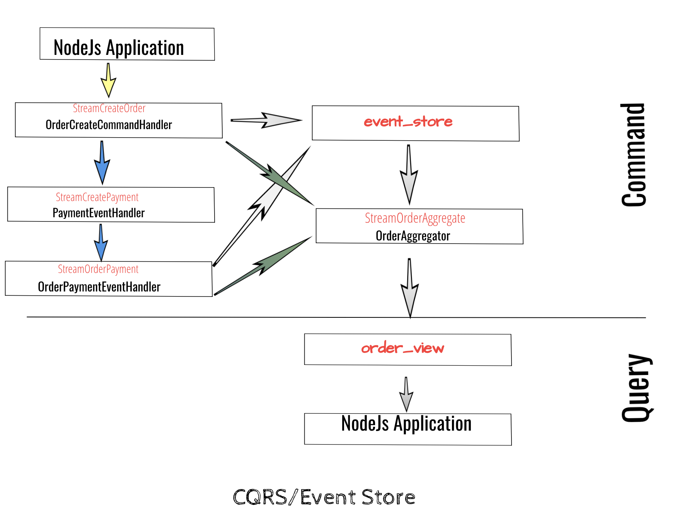
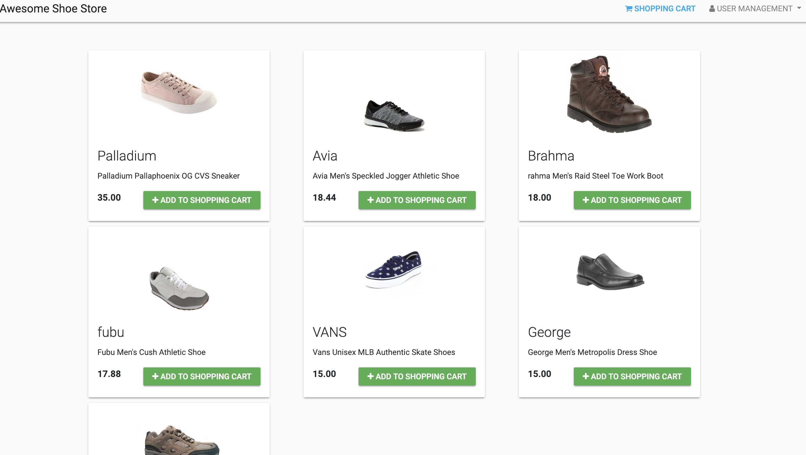

# cqrs

docker run -d -p 6378:6379 --name redismod redislabs/redismod

npm -y install 

# load the database with product info
node seed/product.js 

# reset the Redis 
sh cqrs/reset.sh 

# Start the node apps

#### Can be run on different terminal

npm  start 

node cqrs/1-OrderCreateCommandHandler.js

node cqrs/2-OrderAggregator.js

node cqrs/3-PaymentEventHandler.js

node cqrs/4-OrderPaymentEventHandler.js

# Diagram

# access the UI
http://localhost:3000/

#### For credit card use 4242424242424242

